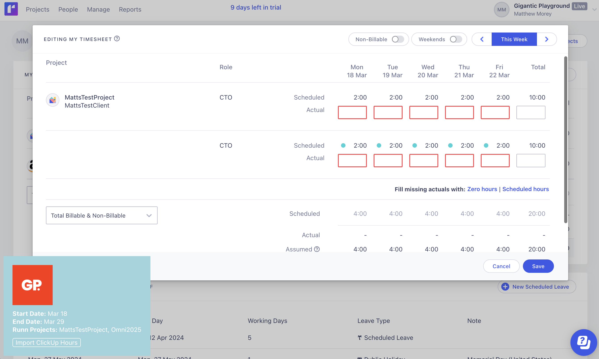

# RunnTimesheetUserscript

## Description

This is a userscript designed to streamline the process of importing time entries from ClickUp into Runn. By fetching project-specific time entries from ClickUp and allowing users to quickly fill them into the Runn timesheet interface, this script saves time and reduces manual entry errors.

**Warning**: Currently, this script only supports importing hours for the current work week.

## Features

- Fetches time entries from ClickUp API.
- Automatically fills the time entries into Runn's timesheet interface.
- Allows users to specify their ClickUp Team ID and API Token securely.
- Provides a convenient UI overlay for easy interaction.

## Installation

1. Ensure you have Tampermonkey installed in your browser or another userscript extension. If not, download and install from [Tampermonkey's website](http://tampermonkey.net/). The script has only been tested with Tampermonkey.
2. Click [here](https://raw.githubusercontent.com/GiganticPlayground/RunnTimesheetUserscript/main/runnUserScript.user.js) to install the script.
3. Once installed, the script will prompt you to enter your ClickUp Team ID, ClickUp API Token, and Runn API Token the first time it runs.

## Setup

To use this script, you need your ClickUp Team ID, ClickUp API Token, and Runn API Token:

1. **Find your ClickUp Team ID**: This can typically be found in your ClickUp URL when you're logged in, e.g., `https://app.clickup.com/{Team_ID}/`.
2. **Generate a ClickUp API Token**: Go to your ClickUp settings, navigate to the Integrations or API section, and generate a new token. See the [ClickUp Documentation](https://clickup.com/api/developer-portal/authentication#personal-token) for more details.
3. **Generate a Runn.io API Token**: API tokens are generated through the Runn application, via “Settings > API”. Only administrators in your Runn account can generate them.

Upon running the script for the first time on a [Runn timesheet page](https://app.runn.io/timesheets), you'll be prompted to enter these details. They are stored securely and used to fetch your time entries.

## Usage

Navigate to your [Runn timesheet page](https://app.runn.io/timesheets). If you're running the script for the first time, follow the prompt to enter your ClickUp Team ID, ClickUp API Token, and Runn API Token.

Once set up, click Edit Timesheets, you'll then see an "Import ClickUp Hours" button on the Runn interface in the bottom left. Clicking this button fetches your time entries from ClickUp and fills them into the corresponding fields in Runn.

## Contributing

We welcome contributions and suggestions! If you'd like to contribute or have found bugs to report, please visit the GitHub repository:

[https://github.com/GiganticPlayground/RunnTimesheetUserscript](https://github.com/GiganticPlayground/RunnTimesheetUserscript)

## Develoopment

To make development eaiser you should use this setup: https://stackoverflow.com/questions/41212558/develop-tampermonkey-scripts-in-a-real-ide-with-automatic-deployment-to-openuser.

## Support

If you encounter any issues or have questions, please file an issue on the GitHub repository. For more detailed inquiries or suggestions, feel free to contact us via Github Issues.

## License

This project is licensed under the MIT License - see the LICENSE file for details.
